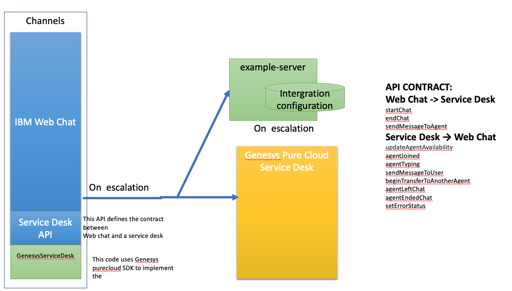

# Genesys PureCloud integration example

This is a functioning service desk integration with Genesys PureCloud. This is a reference implementation that provides a fully functional integration. It is advised that you will conduct robust testing before going live.

## Overview

The Genesys PureCloud Integration comprises of both client side code that runs in the end user browser and server side code that you should host.
\
The client side component manages the communication between the end user and the agent. It implements a pre-defined api that is fully supported by Watson Assistant Web chat integration. The details of this api can be found at [ServiceDesk API](../../types/serviceDesk.ts) and [ServiceDesk Callback](../../types/serviceDeskCallback.ts). The communication uses an SDK provided by Genesys which can be found at [Guest Chat Client - JavaScript](https://developer.mypurecloud.com/api/rest/client-libraries/javascript-guest/index.html). This sdk is based on Websockets which enable two way communication. However, there are certain advanced capabilities that require a different set of APIs which are provided by [Genesys REST APIs](https://developer.mypurecloud.com.au/api/rest/v2/).

## Setting it up

0. If you haven't already, follow the setup steps in the root-level [README](../../../README.md) to ensure you can run an instance of [ExampleServiceDesk](../../serviceDesks/exampleServiceDesk.ts).
1. Update [purecloudSetup.ts](./purecloudSetup.ts) to populate with your organization information.
    - `DEPLOYMENT_ID` -> [create a web chat widget v1.1](https://help.mypurecloud.com/articles/create-a-widget-for-web-chat/)
    - `ORGANIZATION_ID` -> [find my organization ID](https://help.mypurecloud.com/faq/how-do-i-find-my-organization-id/)
2. Go to the project root directory and update `.env` file to update `SERVICE_DESK_CLASS` variable to  `GenesysServiceDesk`. 
3. Go to the project root directory and run `npm run dev` as you normally would. If you've linked everything to your PureCloud account correctly, you should be able to connect to an agent in PureCloud.

As described above, advanced functionality such as authenticated chat and agent availability require a REST API which requires additional setup:

0. The REST API requires access via credentials. If you haven't already, [setup an OAuth client](https://help.mypurecloud.com/articles/create-an-oauth-client/) in PureCloud tooling that uses a client credentials grant.
1. Navigate to the `example-server` directory nested within this directory. Rename `.env-sample` to `.env`, and fill in `GENESYS_CLIENT_ID` and `GENESYS_CLIENT_SECRET` with the credentials from your OAuth client.
2. In the `example-server` directory, run `npm i`.
3. In the `example-server` directory, run `npm start`. This should start a server on port 3000 of your local machine.
4. The server needs to be accessed from the browser of your end users. If you do not have your own hosted environment and you wish to expose your local development, one such possibility  is the usage of [ngrok](https://ngrok.com/):
`ngrok http http://localhost:3000`
5. Copy the resulting forwarding address (copy the HTTPS one!) and set `AUTH_SERVER_BASE_URL` in `purecloudSetup.ts` to that address.
6. In the settings for your web chat widget in PureCloud tooling, set "Require Authentication" to on. Append `/jwt` to your ngrok forwarding address (as in, `<your-ngrok-url>/jwt`) and paste this in the "Authentication URL" field. Hit save.

7. In [genesysServiceDesk.ts](./genesysServiceDesk.ts), set the flags `WIDGET_REQUIRES_AUTHENTICATION` and `AUTHENTICATED_CALLS_ENABLED` to `true`.
    - Note: It's easiest to set the server up in full at the beginning, but these flags are independent. you may disable authentication in your web chat widget and set `WIDGET_REQUIRES_AUTHENTICATION` to `false`, and the server will still fetch an OAuth access token and serve agent availability, and vice versa.
8. Run the service desk dev environment again, if you're not already (`npm run dev`), and test: the server should authenticate the chat and fetch agent availability.
